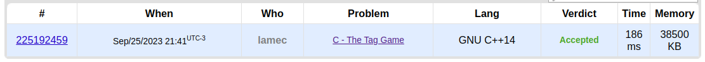

# Exercícios Resolvidos

**Conteúdo da Disciplina**: Grafos 1

## Alunos

|Matrícula | Aluno |
| -- | -- |
| 20/0017772  |  Fellipe Pereira da Costa Silva |
| 18/0104390  |  Lameque Fernandes de Azevedo |

## Sobre 

O repositório contém soluções para algumas questões de juíz online. Segue a lista dos exercicios escolhidos:

- Codeforces Round 408 (Div. 2) - D. Police Stations (https://codeforces.com/contest/796/problem/D)
- Educational Codeforces Round 22 - C. The Tag Game - (http://codeforces.com/contest/813/problem/C)
- SPOJ - DIGOKEYS - Find the Treasure (https://www.spoj.com/problems/DIGOKEYS/)
- SPOJ - SPIKES - Spiky Mazes (https://www.spoj.com/problems/SPIKES/)

## Screenshots

- Resultado do D. Police Stations

- Resultado do C. The Tag Game

- Resultado do DIGOKEYS - Find the Treasure

## Instalação 
Descreva os pré-requisitos para rodar o seu projeto e os comandos necessários.

## Uso 
Explique como usar seu projeto caso haja algum passo a passo após o comando de execução.

## Outros 
Quaisquer outras informações sobre seu projeto podem ser descritas abaixo.

